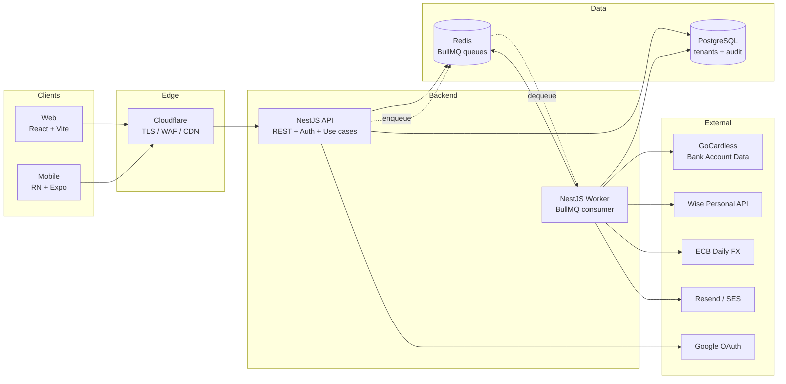
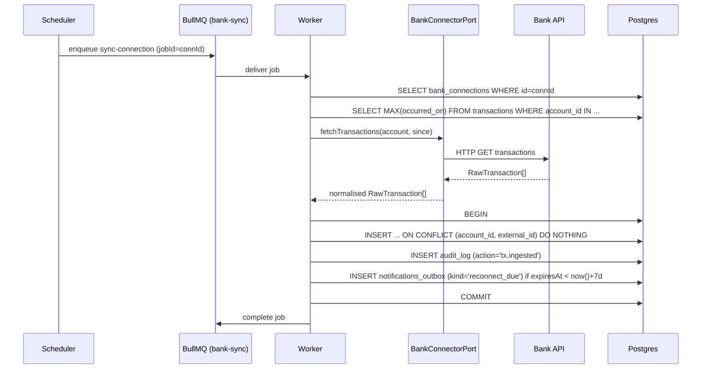

# Power Budget — Technical Architecture (MVP)

> Companion to `PRODUCT.md`. Where this document conflicts with the PRD on product behaviour, the PRD wins. Where this document specifies _how_ to build something, this document wins.

---

## 1. Executive Summary

Power Budget is a household personal-finance app built around one differentiator: a **planned-vs-actual** dashboard that pulls real bank data, lets users map transactions to planned items, and exposes leftover savings and unplanned spend in real time. The MVP targets two users (the author and his partner) on PKO BP and Wise; v2 adds Monobank and broader bank coverage; v3 is multi-tenant SaaS.

The architecture is shaped by four constraints from the PRD:

1. **Future-readiness without rewrite** (PRD §7). Every domain that is "manual now, automated later" — bank connectors, transfer pairing, transaction splits, categorisation, notification channels, locales — must sit behind a port that v2/v3 implementations can satisfy.
2. **Multi-tenant from day one.** Households are first-class. Every domain row is household-scoped. v3 is "support N households", not "introduce the concept".
3. **Clean architecture.** Domain logic is pure TypeScript with no framework or I/O coupling. The reference is `dcervonyj/clean-architecture-reactive` (see §3): a hard split between a pure `base/` (port) layer and a framework-bound adapter layer, with a one-way dependency arrow.
4. **Shared TypeScript core.** Backend, web and mobile share a single `@power-budget/core` package containing domain types and pure logic (planned-vs-actual aggregation, leftover calculation, money/FX). No code duplication between server and clients.

### Stack at a glance

| Concern       | Choice                                                  | Why                                                                                      |
| ------------- | ------------------------------------------------------- | ---------------------------------------------------------------------------------------- |
| Backend       | NestJS + TypeScript                                     | First-class module/DI system maps cleanly to clean-architecture layers; broad ecosystem. |
| Web           | React + Vite + TypeScript                               | Vite for fast dev; React because it shares mental model with mobile.                     |
| Mobile        | React Native + Expo + TypeScript                        | Single codebase with web for shared hooks; EAS Build/Submit handles iOS pipeline.        |
| Shared        | `@power-budget/core` (workspace package)                | One source of truth for domain types and pure logic. No I/O, no React, no Nest.          |
| Database      | PostgreSQL 16                                           | Relational data, strong constraints, JSONB where needed, mature multi-tenancy patterns.  |
| ORM           | Drizzle ORM                                             | TypeScript-native, SQL-first, zero runtime overhead. Justified in §5.1.                  |
| Jobs          | Redis + BullMQ                                          | Per-connection queues, retries, scheduling — fits sync model exactly.                    |
| State (FE)    | Redux Toolkit + RTK Query                               | Single explicit store across web and mobile. Justified in §5.1.                          |
| Bank — PKO    | GoCardless Bank Account Data API                        | Free PSD2 AISP licence; PKO BP supported; sandbox available.                             |
| Bank — Wise   | Wise Personal API (direct)                              | Free, account-holder API; no aggregator needed.                                          |
| FX            | ECB daily reference rates                               | Free, authoritative, daily; cached locally.                                              |
| Email         | Resend (or SES)                                         | Transactional only; locale-aware templating.                                             |
| Auth          | Email + password / magic link / Google OAuth + TOTP 2FA | PRD §4.1. Argon2id hashes, JWT access + opaque refresh.                                  |
| Observability | pino + Prometheus + OpenTelemetry                       | Cheap, standard, container-native.                                                       |

### Top-level system diagram

```
   ┌────────────┐         ┌──────────────────────────────────────┐
   │  Web (Vite)│ ───┐    │           Power Budget API           │
   └────────────┘    │    │            (NestJS, Node)            │
                     │ ───►  ┌──────────────────────────────┐   │
   ┌────────────┐    │    │  │ Presentation: REST + DTOs    │   │
   │ Mobile     │ ───┘    │  │ Application: use cases       │   │
   │ (RN+Expo)  │         │  │ Domain:      @power-budget/  │   │
   └────────────┘         │  │              core (shared)   │   │
                          │  │ Infra:       adapters        │   │
                          │  └──────────────────────────────┘   │
                          └─┬─────────┬─────────┬──────────┬────┘
                            │         │         │          │
                       ┌────▼──┐  ┌───▼────┐ ┌──▼──┐  ┌────▼────┐
                       │Postgres│  │ Redis  │ │ SMTP│  │  External│
                       │  (TX,  │  │+BullMQ │ │     │  │ GoCardless│
                       │  audit)│  │(jobs)  │ │     │  │ Wise / ECB│
                       └────────┘  └────────┘ └─────┘  └──────────┘
```

The same NestJS process serves the REST API and runs the BullMQ workers (deployed as a separate process in production but sharing the codebase). The web and mobile clients are pure consumers of the REST API.

---

## 2. High-Level System Diagram



### Data flow notes

- **Bank sync.** A scheduled job in the worker enqueues one `sync-connection` job per active bank connection (cron: every 4 h plus on-demand). The job calls the matching `BankConnectorPort` adapter (GoCardless for PKO, Wise direct for Wise), fetches transactions since `last_synced_at`, and upserts them in Postgres under the connection's household. Idempotency: `(account_id, external_id)` UNIQUE. Heuristic-mapping suggestions are computed in the same transaction.
- **Dashboard load.** Client calls `GET /plans/:id/dashboard`. The handler executes a single read-only use case backed by a materialised view (`v_plan_actuals`) refreshed on every transaction upsert or plan edit. Result is FX-converted at presentation time using cached daily rates from `fx_rates`. Target: <500 ms p95 for 12 months / 5 000 rows.
- **Transaction mapping.** Client calls `PATCH /transactions/:id/mapping { plannedItemId }`. The use case validates household membership, writes to `transaction_mappings`, emits an audit event, and triggers the materialised-view refresh for the affected plan.
- **Notification dispatch.** Domain events (`reconnect.due`, `over_budget.crossed`, `digest.weekly`) are written to `notifications_outbox` inside the same transaction as the triggering write. A BullMQ outbox-relay job picks them up, resolves recipient locale, renders the template via the i18n loader, and sends via SMTP. Outbox guarantees at-least-once delivery; the consumer is idempotent via outbox `id`.

---

## 3. Clean Architecture Reference

Source: [`dcervonyj/clean-architecture-reactive`](https://github.com/dcervonyj/clean-architecture-reactive) — a TypeScript library for reactive state management built on MobX, but designed so that consumer code never imports MobX. We borrow its **layering, naming and dependency-rule discipline**, not the MobX runtime.

### Layering and dependency rule

The repo splits into exactly two layers:

- `src/base/` — pure TypeScript interfaces. Zero dependencies on MobX, React, or anything I/O. This is the **port** layer.
- `src/react-mobx/` — concrete implementations of those interfaces using MobX + React. This is the **adapter** layer.

The rule is stated explicitly in `CLAUDE.md`:

> **Dependency rule (strict):** `src/base/` must never import from `src/react-mobx/`. The arrow always points inward: `react-mobx → base`.

We adopt the same direction for our backend (Domain ← Application ← Infrastructure / Presentation) and frontend (Domain ← Application ← Infrastructure ← Presentation). Concretely: code under `packages/core/` and the backend `domain/` directory must never import from `infrastructure/`, `presentation/`, NestJS, React, or any I/O library.

### Folder structure

The reference uses one folder per layer at the package root and a flat file layout within. We borrow this for `@power-budget/core` and apply a richer four-layer split inside the backend (because backends do more I/O than a state library). See §4.

### Naming

From `src/base/ReactiveView.ts`, `src/base/Selector.ts`, `src/base/UpdatableArray.ts`: **no `I` prefix on interfaces**. The interface is the canonical name; the implementation gets a tech prefix:

```
base/ReactiveView.ts              →  interface ReactiveView<T> { ... }
react-mobx/MobXReactiveView.ts    →  class MobXReactiveView<T> implements ReactiveView<T>
```

We follow this exactly. `BankConnectorPort`, `TransactionRepo`, `FxRateProvider` are interfaces. Their implementations are `GoCardlessBankConnector`, `DrizzleTransactionRepo`, `EcbFxRateProvider`.

### TypeScript style

From `CLAUDE.md` and the README:

- No `@action` decorator syntax; use explicit registration. We translate this as: **no implicit DI magic**. NestJS providers are explicit, not via decorator-only autowiring of fields. Reading `tsconfig.json` (no `experimentalDecorators: true`) confirms the project sidesteps decorator metadata entirely.
- Compile-time enforcement of invariants where possible (the `Without<>` constraint that prevents `Source` and `Computed` key overlap, `Selectors<FullState>` mapped type that requires one selector per computed key). We mirror this by using **branded types** for IDs (`UserId`, `HouseholdId`) and **exhaustive `switch` over discriminated unions** for domain enums.
- `lodash-es` only, never `lodash`. We follow the same rule.
- Mutations are **explicit actions**, never ambient. In our terms: every state mutation on the frontend goes through an RTK Toolkit reducer; every backend mutation goes through a use case.

### What we keep, what we drop

We keep: layering, dependency direction, naming, port-first design, branded types, pure domain layer, explicit mutation. We drop: MobX runtime, `ReactiveView` abstraction (RTK gives us this on the frontend and Nest's request scope on the backend). The discipline is the import; the library is not.

---

## 4. Monorepo Layout

```
power-budget/
├── packages/
│   ├── core/                      # @power-budget/core — shared pure TS
│   │   ├── src/
│   │   │   ├── domain/            # entity types, value objects
│   │   │   ├── logic/             # pure functions (planned-vs-actual, leftover, FX)
│   │   │   ├── ids.ts             # branded ID types
│   │   │   └── index.ts
│   │   ├── package.json
│   │   └── tsconfig.json
│   │
│   ├── backend/                   # NestJS API + worker
│   │   ├── src/
│   │   │   ├── domain/            # domain services, port interfaces (no I/O)
│   │   │   ├── application/       # use cases (depend on ports only)
│   │   │   ├── infrastructure/    # adapters: Drizzle, GoCardless, Wise, ECB, SMTP, Redis
│   │   │   ├── presentation/      # NestJS controllers, DTOs, guards
│   │   │   ├── worker/            # BullMQ consumers (also use cases)
│   │   │   └── main.ts
│   │   └── drizzle/               # schema + migrations
│   │
│   ├── web/                       # React + Vite
│   │   ├── src/
│   │   │   ├── domain/            # re-exports from @power-budget/core
│   │   │   ├── application/       # RTK slices + RTK Query endpoints
│   │   │   ├── infrastructure/    # API client, localStorage, i18n loader
│   │   │   ├── presentation/      # screens, components
│   │   │   └── main.tsx
│   │   └── public/locales/        # en/uk/ru/pl JSON
│   │
│   └── mobile/                    # React Native + Expo
│       ├── src/                   # same four-layer split as web
│       │   ├── domain/
│       │   ├── application/
│       │   ├── infrastructure/
│       │   ├── presentation/
│       │   └── App.tsx
│       └── assets/locales/
│
├── docker-compose.yml             # local Postgres + Redis
├── turbo.json                     # Turborepo pipeline
├── pnpm-workspace.yaml
└── package.json                   # workspace root
```

### What lives in each package

**`@power-budget/core`** — pure TypeScript. The single source of truth for domain language. Imported by every other package. Compiles with `tsc` to ESM; no bundler.

Contents:

- **Domain types**: `User`, `Household`, `HouseholdMember`, `Account`, `BankConnection`, `Transaction`, `Mapping`, `Transfer`, `Plan`, `PlannedItem`, `PlannedItemVersion`, `Category`, `CategoryPrivacy`, `Currency`, `Money`, `FxRate`, `Locale`, `LeftoverEntry`, `AuditEvent`, `NotificationKind`.
- **Branded ID types**: `UserId`, `HouseholdId`, `AccountId`, `TransactionId`, `PlanId`, `PlannedItemId`, `CategoryId`, `BankConnectionId`. Each is `string & { readonly __brand: '<Name>Id' }`.
- **Value objects**: `Money` (amount in minor units + ISO 4217 currency), `DateRange`, `LocaleCode`.
- **Pure logic**:
  - `computePlanActuals(plan, plannedItems, transactions, mappings): PlanActualsView` — the heart of the dashboard.
  - `computeLeftover(plan, plannedItems, transactions, mappings): LeftoverEntry[]` — per-item and total.
  - `convertMoney(money, targetCurrency, rates): Money` — FX conversion using a `FxRateTable` snapshot.
  - `aggregateByCategoryWithPrivacy(transactions, mappings, categories, viewerUserId, privacyMap): CategoryAggregate[]` — applies the per-category privacy rules.
  - `applyMappingSuggestion(transaction, priorMappings): PlannedItemId | null` — the heuristic categoriser.

**Banned in `@power-budget/core`**:

- `import 'react'`, `import '@nestjs/*'`, `import 'drizzle-orm'`, `import 'axios'`, `import 'fs'`, `import 'crypto'` (Node-specific), DOM types, React Native types.
- No HTTP, no DB, no file I/O, no `Date.now()` calls inside pure functions (pass clock explicitly).
- No singletons, no global state.
- Enforced via ESLint rule `no-restricted-imports` on the package.

**`packages/backend`** — NestJS. Hosts the API and the worker. Imports `@power-budget/core`. Banned: importing from `web/` or `mobile/`.

**`packages/web`** — React + Vite. Imports `@power-budget/core`. Banned: importing from `backend/` (it talks to backend over HTTP).

**`packages/mobile`** — React Native + Expo. Imports `@power-budget/core`. Banned: importing from `web/` or `backend/`. Components that don't depend on DOM/React Native primitives can be hoisted to a `packages/ui-kit` if/when justified — not in MVP.

### Why a separate `core` package, not just a `shared/` folder

Because TypeScript path aliases in a multi-project setup leak transitive deps. Packaging `core` as a workspace package with its own `package.json` and explicit `dependencies: {}` (none) makes the "no I/O in core" rule enforceable: a `pnpm install` failure or a forbidden import is caught immediately. Mirrors the `src/base/` isolation in the reference repo.

---

## 5. Domain Sections

Each domain is documented with the same template: purpose, core concepts, backend/frontend layering, key ports, cross-domain deps, open questions.

### 5.1 Authentication & Users

**Purpose.** Identify users, group them into households, and protect bank data with mandatory 2FA. Supports email+password, magic link, and Google OAuth at signup; TOTP becomes mandatory the moment a bank is connected (PRD §4.1). Future-ready for Apple / Microsoft / SAML SSO in v3.

**Core concepts.**

- **User** — single identity, has a `localePreference`, a `defaultLocale` (auto-detected fallback), zero or more `AuthMethod`s.
- **AuthMethod** — a row per credential type (`password`, `magic_link`, `google_oauth`). A user can have several.
- **Session** — refresh-token-backed login session; opaque refresh + short-lived JWT access.
- **TotpSecret** — Argon2id-wrapped per-user TOTP secret; required for any session that touches bank data.
- **Household** — tenant boundary. Created by the first user; second user joins via signed `HouseholdInvite`.
- **HouseholdInvite** — single-use token, expires in 7 days, bound to email.
- **MagicLinkToken** — single-use, 15 min TTL.

**Backend — Clean Architecture.**

- **Domain layer.** `User`, `Household`, `Session`, `TotpSecret`, `HouseholdInvite` entities; `PasswordHashing`, `TotpVerifier` domain services as interfaces; `HouseholdInvariants` (single household per user in MVP).
- **Application layer.** Use cases — `RegisterUser`, `LoginWithPassword`, `RequestMagicLink`, `ConsumeMagicLink`, `LoginWithGoogle`, `EnableTotp`, `VerifyTotp`, `CreateHousehold`, `InviteToHousehold`, `AcceptInvite`, `UpdateLocalePreference`, `GetCurrentUser`. Each depends only on ports.
- **Infrastructure layer.** `DrizzleUserRepo` (UserRepo port), `DrizzleHouseholdRepo`, `Argon2PasswordHashing` (PasswordHashing port), `Otplib​TotpVerifier`, `GoogleOauthClient` (OAuthProviderPort), `JwtAccessTokenIssuer`, `RedisRefreshTokenStore`.
- **Presentation layer.** REST:
  - `POST /auth/register` — body `{ email, password, locale? }` → `{ userId }` + verification mail.
  - `POST /auth/login` — body `{ email, password, totp? }` → `{ accessToken, refreshToken }` (TOTP demanded only if user has bank connections).
  - `POST /auth/magic-link/request` — body `{ email }` → 204.
  - `POST /auth/magic-link/consume` — body `{ token }` → tokens.
  - `GET /auth/oauth/google/start` → 302 to Google.
  - `GET /auth/oauth/google/callback` → tokens or onboarding redirect.
  - `POST /auth/totp/enable` → `{ qrCodeUri, recoveryCodes }`.
  - `POST /auth/totp/verify` — body `{ code }`.
  - `POST /auth/refresh` — body `{ refreshToken }` → new pair.
  - `POST /auth/logout` — revoke refresh.
  - `POST /households` — create.
  - `POST /households/:id/invites` → `{ inviteUrl }`.
  - `POST /invites/:token/accept`.
  - `PATCH /me` — partial profile update including `localePreference`.

**Frontend — Clean Architecture.**

- **Domain types** from `@power-budget/core`: `User`, `Household`, `LocaleCode`.
- **Application layer.** RTK slice `auth` (tokens, current user, household), RTK Query endpoints under `authApi` (login, refresh, profile). Tokens persisted in `localStorage` (web) / `expo-secure-store` (mobile). Auto-refresh interceptor.
- **Infrastructure.** `ApiClient` (axios instance with auth interceptor + token rotation), `SecureTokenStore` adapter.
- **Presentation.** Screens: `LoginScreen`, `RegisterScreen`, `MagicLinkScreen`, `OAuthCallbackScreen`, `TotpEnrollmentScreen`, `OnboardingFlow` (5-step from PRD §4.1), `ProfileScreen`, `HouseholdScreen`, `AcceptInviteScreen`.

**Key ports.**

```ts
export interface UserRepo {
  findById(id: UserId): Promise<User | null>;
  findByEmail(email: string): Promise<User | null>;
  create(user: NewUser): Promise<User>;
  updateLocalePreference(id: UserId, locale: LocaleCode): Promise<void>;
}

export interface PasswordHashing {
  hash(plain: string): Promise<string>;
  verify(plain: string, hash: string): Promise<boolean>;
  needsRehash(hash: string): boolean;
}

export interface TotpVerifier {
  generateSecret(label: string): { secret: string; otpauthUri: string };
  verify(secret: string, code: string, window?: number): boolean;
}

export interface OAuthProviderPort {
  buildAuthorizeUrl(state: string, redirectUri: string): string;
  exchange(
    code: string,
    redirectUri: string,
  ): Promise<{ email: string; subject: string; emailVerified: boolean }>;
}

export interface RefreshTokenStore {
  issue(userId: UserId, ttlSeconds: number): Promise<string>;
  rotate(
    oldToken: string,
  ): Promise<{ userId: UserId; newToken: string } | null>;
  revoke(token: string): Promise<void>;
}
```

**State and ORM picks (decided once, reused everywhere).**

- **State management: Redux Toolkit + RTK Query.** Chosen over Zustand and TanStack Query because (a) RTK Query gives normalised cache, tag-based invalidation, and optimistic updates out of the box, which exactly fits the planned/actual/mapping invalidation graph; (b) a single store across web and mobile reduces cognitive load; (c) RTK reducers are explicit actions, in keeping with the reference repo's "no ambient mutation" rule. The shared slices live in a thin `packages/web/src/application/` and `packages/mobile/src/application/` — duplicated intentionally because routing and persistence differ; the underlying domain types come from `@power-budget/core`.
- **ORM / persistence: Drizzle ORM.** Chosen over Prisma because (a) zero runtime, no separate engine binary — important for cold-start on Fly.io / serverless; (b) SQL-first migrations as code, no `prisma db push` magic; (c) types derived from schema, no `@prisma/client` generation step; (d) raw SQL escape hatch for the materialised view used by the dashboard. Prisma's nicer migrate UX is not worth the size and operational cost for an MVP.

**Cross-domain dependencies.** Authentication owns the `User` and `Household` entities; every other domain reads `householdId` from the authenticated session and uses it as a tenant filter. No domain depends on auth internals beyond a `RequestContext` value object (`{ userId, householdId, locale }`).

**Open questions.**

1. **Recovery codes vs. account-recovery email when TOTP is lost?** _Recommendation:_ both. Print recovery codes on enrolment; allow email-based reset that revokes all sessions and forces re-enrolment of TOTP and re-consent of all bank connections.
2. **Should TOTP be required for all logins, or only when bank data is touched?** _Recommendation:_ PRD says "mandatory once a bank is connected". Enforce TOTP at login if the user has any active bank connection; otherwise TOTP is optional. Step-up if the user later connects.
3. **Single household per user in MVP, but data model is N:M.** _Recommendation:_ model `household_users` as M:N from day one; enforce single-household via application invariant. v2 lifts the invariant, schema unchanged.
4. **Magic-link replay window.** _Recommendation:_ 15-min TTL, single-use, invalidate sibling links on issue.

### 5.2 Bank Connections

**Purpose.** Provide a uniform interface over heterogeneous bank APIs so that the rest of the system never sees vendor differences. MVP integrates GoCardless (Bank Account Data API) for PKO BP and Wise Personal API directly. v2 adds Monobank; v3 adds Salt Edge / Plaid. The `BankConnectorPort` abstraction is non-negotiable — it is the single most important seam in the codebase.

**Core concepts.**

- **BankProvider** — the integration mechanism: `gocardless`, `wise_personal`. A static registry.
- **Bank** — a specific institution offered by a provider (e.g. `gocardless:PKO_BP_PL_BPKOPLPW`). PRD calls this "the bank".
- **BankConnection** — a user-owned binding to one bank: provider, bank, consent token, consent-expiry timestamp.
- **BankAccount** — a single account inside a connection (PKO Konto Osobiste, Wise PLN balance, Wise EUR balance). Belongs to a connection. Always private to the connection's owner (PRD §4.9).
- **ConsentLifecycle** — states `pending | active | expiring | expired | disconnected`. GoCardless PSD2 consent is fixed 90 days; Wise tokens are user-revocable but do not expire on a schedule.
- **HistoryWindow** — at connect time the user picks how far back to import (PRD §4.2).
- **SyncRun** — one execution of the per-connection sync job (audit + observability).

**Backend — Clean Architecture.**

- **Domain layer.** `BankConnection`, `BankAccount`, `Consent`, `SyncRun` entities. Domain service `ConsentExpiryPolicy` that knows the reminder schedule (7d / 1d / on-expiry — PRD §4.10). `BankConnectorPort` interface (see below) plus provider-agnostic `RawTransaction` DTO.
- **Application layer.** Use cases — `InitiateBankConnection`, `CompleteBankConsent`, `ListUserConnections`, `RefreshConnection` (on-demand), `ScheduleConnectionSync`, `RunConnectionSync`, `DisconnectBank`, `ReconnectBank` (preserves history per PRD §4.2). Depend on `BankConnectorRegistry` and `BankConnectionRepo` ports.
- **Infrastructure layer.** `GoCardlessBankConnector implements BankConnectorPort` (uses official OpenAPI client; encrypts the consent token at rest using the user's DEK — see §6). `WiseBankConnector implements BankConnectorPort` (uses Wise REST API directly; user pastes their Wise API token during connect). `BankConnectorRegistry` resolves a `BankConnectorPort` by `BankProvider`. `DrizzleBankConnectionRepo`, `DrizzleSyncRunRepo`. BullMQ scheduler enqueues `sync-connection` every 4 h + after consent completion.
- **Presentation layer.** REST:
  - `GET /banks` → catalogue (provider + bank + supported countries + max history).
  - `POST /bank-connections/initiate` — body `{ bankId, redirectUri, historyDays }` → `{ consentUrl, connectionId }`.
  - `POST /bank-connections/:id/complete` — body `{ consentToken }` (called by app after redirect-back).
  - `GET /bank-connections` → list user's connections + last-sync + consent-expiry.
  - `POST /bank-connections/:id/refresh` — enqueue immediate sync; returns `{ jobId }`.
  - `POST /bank-connections/:id/reconnect` → new consent URL; reuses connection id.
  - `DELETE /bank-connections/:id` — disconnect (keep history).
  - `GET /bank-connections/:id/sync-runs` → audit list.

**Frontend — Clean Architecture.**

- **Domain types** from `@power-budget/core`: `BankConnection`, `BankAccount`, `ConsentLifecycle`.
- **Application layer.** RTK slice `bankConnections`; RTK Query `bankApi` with tags `BankConnection`, `BankAccount`; consent-redirect handling via a dedicated `oauth-callback` route that captures the provider token and posts to `/complete`.
- **Infrastructure.** Same `ApiClient` as auth; no provider-specific code on the client. The "consent screen" is a hosted page on the bank's side — the app only handles redirect-back.
- **Presentation.** Screens: `BankConnectionsList`, `AddBankFlow` (pick provider → pick bank → choose history → consent → review accounts), `ReconnectBanner` (global; appears when `consent.expiresAt < now + 7d`), `SyncStatusChip` (last synced N minutes ago).

**Key ports.**

```ts
export interface BankConnectorPort {
  readonly provider: BankProvider;
  listSupportedBanks(country: CountryCode): Promise<BankCatalogEntry[]>;
  initiateConsent(input: {
    userId: UserId;
    bankId: BankId;
    redirectUri: string;
    historyDays: number;
  }): Promise<{ consentUrl: string; externalConsentRef: string }>;
  completeConsent(input: {
    externalConsentRef: string;
    callbackPayload: Record<string, string>;
  }): Promise<{ consentToken: EncryptedString; expiresAt: Date | null }>;
  listAccounts(
    connectionId: BankConnectionId,
    consent: EncryptedString,
  ): Promise<RawBankAccount[]>;
  fetchTransactions(input: {
    accountExternalId: string;
    consent: EncryptedString;
    since: Date;
  }): Promise<RawTransaction[]>;
  refreshConsent(
    connectionId: BankConnectionId,
  ): Promise<{ consentUrl: string }>;
  disconnect(
    connectionId: BankConnectionId,
    consent: EncryptedString,
  ): Promise<void>;
}

export interface BankConnectionRepo {
  create(conn: NewBankConnection): Promise<BankConnection>;
  findById(
    id: BankConnectionId,
    scope: HouseholdScope,
  ): Promise<BankConnection | null>;
  listByUser(userId: UserId): Promise<BankConnection[]>;
  updateConsent(
    id: BankConnectionId,
    consent: EncryptedString,
    expiresAt: Date | null,
  ): Promise<void>;
  markDisconnected(id: BankConnectionId, at: Date): Promise<void>;
}

export interface SyncRunRepo {
  start(connectionId: BankConnectionId): Promise<SyncRunId>;
  finish(
    id: SyncRunId,
    result: { ok: boolean; fetched: number; error?: string },
  ): Promise<void>;
  lastSuccessfulAt(connectionId: BankConnectionId): Promise<Date | null>;
}
```

**Cross-domain dependencies.** Owned by Bank Connections: `bank_connections`, `bank_accounts`. Read by Transactions (to attribute incoming transactions to an account). Read by Notifications (to fire reconnect reminders). No write dependencies outward.

**Open questions.**

1. **GoCardless rate limits and history depth in production.** _Recommendation:_ validate against sandbox during sprint 2; fall back to 90 days max if 365 is restricted.
2. **Wise webhook vs. polling.** _Recommendation:_ polling only in MVP (every 4 h). Wise webhooks require a public URL and TLS proof; add in v2 to reduce sync latency.
3. **Consent encryption.** _Recommendation:_ per-user DEK wrapped by a master KEK from KMS / env. See §6.
4. **Multiple connections to the same bank by the same user.** _Recommendation:_ allow. Unique constraint is `(userId, externalConsentRef)`, not `(userId, bankId)`.

### 5.3 Transactions

**Purpose.** The single ledger of money movement. Sources: bank sync (PKO via GoCardless, Wise direct) and manual entry. Provides idempotent ingest, transfer-marking with v2-ready data model, mapping to planned items, and heuristic suggestions.

**Core concepts.**

- **Transaction** — date, original `Money`, account, optional merchant, optional `description`, `source` (`bank` | `manual`), optional notes, `externalId` (only for `bank`).
- **TransactionMapping** — exactly one `plannedItemId` per transaction in MVP. Modelled as a separate row to make v2 multi-line splits a non-migration.
- **Transfer** — pair-link between two transactions across the user's own accounts. In MVP one side may be `null` (user marks before counterpart is visible). In v2, auto-pairing fills the `null` side.
- **Ignore flag** — `ignored: boolean` on the transaction; excludes from totals and suggestions.
- **Suggestion** — computed at write time: based on merchant → planned-item history, attached as `suggestedPlannedItemId`.

**Backend — Clean Architecture.**

- **Domain layer.** `Transaction`, `TransactionMapping`, `Transfer`, `IngestBatch`. Domain service `IdempotentIngest` (combines `(account_id, external_id)` and `source = manual` semantics). Domain service `MappingSuggestion` (pure; takes prior mappings + new transaction → optional planned item).
- **Application layer.** Use cases — `IngestBankTransactions` (called by worker; idempotent), `CreateManualTransaction`, `UpdateTransactionNotes`, `MapTransaction`, `UnmapTransaction`, `MarkAsTransfer`, `LinkTransferCounterpart`, `IgnoreTransaction`, `BulkMap`, `BulkMarkAsTransfer`, `ListTransactions` (paginated, filterable per PRD §4.3).
- **Infrastructure layer.** `DrizzleTransactionRepo`, `DrizzleMappingRepo`, `DrizzleTransferRepo`. Worker `BankSyncProcessor` invokes `BankConnectorPort.fetchTransactions`, normalises into `RawTransaction`, then calls `IngestBankTransactions`. Materialised-view refresh trigger fires on every mapping change (deferred — actual refresh is debounced 250 ms in the worker).
- **Presentation layer.** REST:
  - `GET /transactions?accountId=&from=&to=&category=&mapped=&source=&q=&cursor=` — paginated.
  - `POST /transactions` — manual create.
  - `PATCH /transactions/:id` — body `{ notes?, ignored? }`.
  - `PATCH /transactions/:id/mapping` — body `{ plannedItemId | null }`.
  - `POST /transactions/:id/transfer` — body `{ counterpartTransactionId? }`.
  - `DELETE /transactions/:id/transfer` — unmark.
  - `POST /transactions/bulk` — body `{ ids, op: 'map' | 'transfer' | 'ignore', payload }`.

**Frontend — Clean Architecture.**

- **Domain types** from `@power-budget/core`: `Transaction`, `TransactionMapping`, `Transfer`, `Money`.
- **Application layer.** RTK Query `transactionsApi` with tags `Transaction`, `Mapping`, `PlanActuals`. Optimistic updates for map/unmap so the dashboard reflects the change before the server roundtrip; rollback on error. Cursor-based infinite scroll.
- **Infrastructure.** API client; no local SQLite cache in MVP (mobile relies on RTK Query cache + persisted store).
- **Presentation.** Screens: `TransactionsList`, `TransactionDetail`, `MappingModal` (pick plan → planned item; suggestions float to top), `BulkActionBar`, `ManualTransactionForm`, `TransferMarkModal`.

**Key ports.**

```ts
export interface TransactionRepo {
  upsertByExternalId(
    input: NewTransaction,
  ): Promise<{ id: TransactionId; created: boolean }>;
  insertManual(input: NewManualTransaction): Promise<Transaction>;
  findById(
    id: TransactionId,
    scope: HouseholdScope,
  ): Promise<Transaction | null>;
  list(
    query: TransactionQuery,
    scope: HouseholdScope,
  ): Promise<Page<Transaction>>;
  patch(
    id: TransactionId,
    patch: Partial<Pick<Transaction, "notes" | "ignored">>,
  ): Promise<void>;
}

export interface MappingRepo {
  set(
    transactionId: TransactionId,
    plannedItemId: PlannedItemId | null,
    by: UserId,
  ): Promise<void>;
  bulkSet(
    input: { transactionId: TransactionId; plannedItemId: PlannedItemId }[],
    by: UserId,
  ): Promise<void>;
  findByTransaction(id: TransactionId): Promise<TransactionMapping | null>;
}

export interface TransferRepo {
  mark(
    transactionId: TransactionId,
    counterpart: TransactionId | null,
    by: UserId,
  ): Promise<TransferId>;
  unmark(transactionId: TransactionId): Promise<void>;
  findByTransaction(id: TransactionId): Promise<Transfer | null>;
}
```

**Cross-domain dependencies.** Reads: `bank_accounts` (to validate ownership), `planned_items` (for mapping). Writes: own tables + emits `transaction.ingested`, `transaction.mapped`, `transaction.transferred` domain events for the audit log and materialised view refresh.

**Open questions.**

1. **Idempotency key when bank `externalId` is missing.** _Recommendation:_ fall back to a hash of `(account, date, amount, normalised_description)` and store in `external_id`. Some banks omit IDs entirely; this is GoCardless-documented behaviour for older transactions.
2. **Auto-categorisation v1 (heuristic).** _Recommendation:_ in MVP, `MappingSuggestion` runs server-side on ingest and writes `suggested_planned_item_id`. The user always confirms. v2 replaces the heuristic with an LLM-backed classifier behind the same interface.
3. **Split-readiness.** _Recommendation:_ `transaction_mappings.amount_minor` column added now, defaulted to the transaction amount; never written to in MVP. v2 lets it diverge to enable splits — no migration needed.
4. **Deletion vs. soft-delete.** _Recommendation:_ bank transactions are never deleted (PRD §4.2 — disconnect preserves history); manual transactions soft-delete to keep audit consistent.

### 5.4 Plans & Planned Items

**Purpose.** The plan-based budgeting that is the product's killer feature. Personal and household plans, weekly/monthly/custom periods, audit-trail-versioned edits, plan cloning, multiple-active-plans, leftover bucket.

**Core concepts.**

- **Plan** — `(name, type: personal | household, periodKind: weekly | monthly | custom, periodStart, periodEnd, ownerUserId?, householdId, baseCurrency)`. `ownerUserId` only set for `type=personal`.
- **PlannedItem** — `(planId, categoryId, direction: income | expense, amount: Money, note?)`.
- **PlannedItemVersion** — append-only history. Every change to a planned item writes a new row with `effectiveAt`, `changedBy`, `previousAmount`, `newAmount`, `reason?`.
- **PlanScope** — at query time, "active plans for user X in household Y on date D" = personal plans owned by X + household plans of Y where `periodStart <= D <= periodEnd`.
- **LeftoverEntry** — derived, not stored. Computed by `computeLeftover` in `@power-budget/core` from plan + planned items + transactions + mappings. Optionally snapshotted to `leftover_snapshots` at period close.

**Backend — Clean Architecture.**

- **Domain layer.** `Plan`, `PlannedItem`, `PlannedItemVersion` entities. Domain service `PlanCloning` (clones structure: categories + amounts, fresh period). Domain service `LeftoverCalculator` (delegates to core `computeLeftover`). Invariant: in MVP at most one active plan of each `(type, periodKind)` per user/household at a time — except `custom`, which has no such limit.
- **Application layer.** Use cases — `CreatePlan`, `UpdatePlan`, `ClonePlanFromPrevious`, `ArchivePlan`, `ListActivePlans`, `GetPlanDashboard` (returns the `PlanActualsView`), `AddPlannedItem`, `UpdatePlannedItem` (writes a `PlannedItemVersion`), `RemovePlannedItem`, `GetPlannedItemHistory`, `ClosePeriodSnapshot` (called by scheduled job at period end).
- **Infrastructure layer.** `DrizzlePlanRepo`, `DrizzlePlannedItemRepo`, `DrizzlePlannedItemVersionRepo`. Materialised view `v_plan_actuals(plan_id, planned_item_id, actual_minor)` refreshed by trigger or worker. Scheduled job `close-periods` runs daily at 00:30 UTC.
- **Presentation layer.** REST:
  - `GET /plans?active=true&date=` → list.
  - `POST /plans` — body `{ name, type, periodKind, periodStart, periodEnd, baseCurrency }`.
  - `PATCH /plans/:id`.
  - `POST /plans/:id/clone` — body `{ name, periodStart, periodEnd }`.
  - `DELETE /plans/:id` — soft archive.
  - `GET /plans/:id/dashboard` → `PlanActualsView` (income lines, expense lines with planned/actual/leftover, unplanned totals, leftover total).
  - `POST /plans/:id/items` — body `{ categoryId, direction, amount, note? }`.
  - `PATCH /plans/:id/items/:itemId` — body `{ amount?, note?, categoryId? }` (writes version row).
  - `DELETE /plans/:id/items/:itemId`.
  - `GET /plans/:id/items/:itemId/history`.

**Frontend — Clean Architecture.**

- **Domain types** from `@power-budget/core`: `Plan`, `PlannedItem`, `PlannedItemVersion`, `PlanActualsView`, `LeftoverEntry`.
- **Application layer.** RTK Query `plansApi` with tags `Plan`, `PlanActuals`, `PlannedItemHistory`. Mapping changes invalidate `PlanActuals` for the affected plan only.
- **Infrastructure.** None plan-specific.
- **Presentation.** Screens: `PlansList`, `PlanEditor`, `Dashboard` (consumes `GET /plans/:id/dashboard` — the home screen per PRD §4.11), `PlannedItemHistoryDrawer`, `ClonePlanModal`, `CustomPeriodPicker`.

**Key ports.**

```ts
export interface PlanRepo {
  create(plan: NewPlan): Promise<Plan>;
  findById(id: PlanId, scope: HouseholdScope): Promise<Plan | null>;
  listActive(query: {
    userId: UserId;
    householdId: HouseholdId;
    date: Date;
  }): Promise<Plan[]>;
  archive(id: PlanId, at: Date): Promise<void>;
}

export interface PlannedItemRepo {
  add(item: NewPlannedItem): Promise<PlannedItem>;
  update(
    id: PlannedItemId,
    patch: PlannedItemPatch,
    changedBy: UserId,
    reason?: string,
  ): Promise<PlannedItem>;
  remove(id: PlannedItemId): Promise<void>;
  listByPlan(planId: PlanId): Promise<PlannedItem[]>;
}

export interface PlannedItemVersionRepo {
  append(version: NewPlannedItemVersion): Promise<void>;
  listByItem(itemId: PlannedItemId): Promise<PlannedItemVersion[]>;
}

export interface PlanActualsReader {
  read(planId: PlanId, asOf: Date): Promise<PlanActualsView>;
}
```

**Cross-domain dependencies.** Plans read `categories` (FK). Plans are written-against by Transactions (`MappingRepo.set` references `plannedItemId`). Plans publish `plan.created`, `plan.item.changed` events for the audit log.

**Open questions.**

1. **Period overlap when cloning weekly/monthly plans.** _Recommendation:_ clone creates the next contiguous period by default (next week, next month). User can override.
2. **Versioning UI noise.** _Recommendation:_ roll up consecutive edits by the same user within 60 s into a single visible "change" entry (storage still keeps each row).
3. **Custom-period plans on the dashboard.** _Recommendation:_ the dashboard's default is the monthly personal plan; a tab strip exposes all currently-active plans, including custom.
4. **Cross-currency planned items.** _Recommendation:_ each planned item has its own currency; the dashboard aggregates by converting to the plan's `baseCurrency` using daily FX. Display the original alongside.

### 5.5 Categories & Sharing

**Purpose.** Categories are the household's shared taxonomy. Each category has a household-visibility setting that controls what one user sees of the other's spending in that category (PRD §4.9). The model must allow per-category privacy without leaking account-level data.

**Core concepts.**

- **Category** — `(name, icon, color, archivedAt?)`, household-scoped. Pre-seeded set in all four MVP languages.
- **CategoryPrivacy** — `(categoryId, level: total_only | total_with_counts | full_detail)`. One row per category; defaults to `total_only` (PRD §4.9).
- **CategoryAggregate** — derived view shown to the _other_ user; honours privacy level. `full_detail` exposes per-transaction merchant + date + amount but **never** the source account.

**Backend — Clean Architecture.**

- **Domain layer.** `Category`, `CategoryPrivacy`, `CategoryAggregate` types. Pure function `aggregateByCategoryWithPrivacy` in `@power-budget/core` is the single place the privacy rule is implemented. Invariant: category names are unique-per-household when not archived.
- **Application layer.** Use cases — `ListCategories`, `CreateCategory`, `RenameCategory`, `ArchiveCategory`, `SetCategoryPrivacy`, `GetHouseholdCategoryAggregate` (returns `CategoryAggregate[]` for viewer X looking at category C; applies privacy).
- **Infrastructure layer.** `DrizzleCategoryRepo`, `DrizzleCategoryPrivacyRepo`. Seed migration installs default categories in all four locales (storing a `seedKey` to allow translation updates without renaming user-created rows).
- **Presentation layer.** REST:
  - `GET /categories` → list (own household).
  - `POST /categories` — body `{ name, icon, color }`.
  - `PATCH /categories/:id` — body `{ name?, icon?, color? }`.
  - `DELETE /categories/:id` → archive.
  - `PATCH /categories/:id/privacy` — body `{ level }`.
  - `GET /categories/:id/aggregate?planId=&period=` → respects viewer's permitted level.

**Frontend — Clean Architecture.**

- **Domain types** from `@power-budget/core`: `Category`, `CategoryPrivacy`, `CategoryAggregate`.
- **Application layer.** RTK Query `categoriesApi`. `Category` is referenced by every plan and transaction screen; cached aggressively.
- **Infrastructure.** None category-specific.
- **Presentation.** Screens: `CategoriesScreen` (list + privacy toggle per row), `CategoryPickerModal`, `HouseholdCategoryDrillIn` (renders to the level allowed by the partner — total bar, total+counts, or full list).

**Key ports.**

```ts
export interface CategoryRepo {
  list(scope: HouseholdScope): Promise<Category[]>;
  create(input: NewCategory): Promise<Category>;
  update(id: CategoryId, patch: CategoryPatch): Promise<Category>;
  archive(id: CategoryId, at: Date): Promise<void>;
}

export interface CategoryPrivacyRepo {
  get(categoryId: CategoryId): Promise<CategoryPrivacy>;
  set(
    categoryId: CategoryId,
    level: CategoryPrivacyLevel,
    by: UserId,
  ): Promise<void>;
}

export interface HouseholdCategoryAggregateReader {
  read(input: {
    categoryId: CategoryId;
    viewerUserId: UserId;
    range: DateRange;
  }): Promise<CategoryAggregate>;
}
```

**Cross-domain dependencies.** Categories are referenced by Plans (`planned_items.category_id`) and Transactions (indirectly via Mapping). The privacy rule is applied at read time only — storage is unchanged regardless of level.

**Open questions.**

1. **Privacy demotion.** _Recommendation:_ lowering privacy (e.g. `full_detail → total_only`) takes effect immediately and applies retroactively to the partner's UI cache (cache invalidation via RTK Query tag). No historical-view loophole.
2. **Custom-category translations.** _Recommendation:_ per PRD §4.9, user-entered names are stored as entered; only `seedKey`-marked defaults are localised at read time.
3. **Archive semantics.** _Recommendation:_ archived categories remain visible in historical transactions and dashboards but are hidden from new-item pickers.
4. **Bulk-rename of seeded categories.** _Recommendation:_ the user can rename a seeded category; doing so detaches it from its `seedKey` (no auto-update on locale change).

### 5.6 Multi-currency & FX

**Purpose.** Let every user pick a base currency for aggregations plus a set of "interesting" currencies that any displayed amount can be switched into (PRD §4.4). All bank-reported amounts are stored in original currency; conversion is computed at display, but daily rates are snapshotted at storage time so historical figures never shift.

**Core concepts.**

- **Currency** — ISO 4217 code + minor-unit exponent + display symbol/locale rules.
- **Money** — `{ amountMinor: bigint; currency: CurrencyCode }`. Value object in `@power-budget/core`. All arithmetic is integer; no floats anywhere.
- **FxRate** — `(base, quote, rateOnDate, sourceDate)`. Source is always `ECB`; missing days copy forward from the previous available date (ECB does not publish weekends).
- **FxRateTable** — a snapshot for a given date. Pure structure passed into `convertMoney`.
- **UserCurrencyPreferences** — `(userId, baseCurrency, interestingCurrencies)`.

**Backend — Clean Architecture.**

- **Domain layer.** `Currency`, `Money`, `FxRate`, `FxRateTable` value objects. Pure functions `convertMoney(money, target, table)` and `convertMoneyAsOf(money, target, date, repo)`. `FxRateProvider` port.
- **Application layer.** Use cases — `UpdateCurrencyPreferences`, `GetCurrencyPreferences`, `GetFxRate` (on-demand convert via API), `IngestEcbDailyRates` (called by scheduled job).
- **Infrastructure layer.** `EcbFxRateProvider implements FxRateProvider` (parses the daily ECB XML `eurofxref-daily.xml`; derives non-EUR pairs by cross-rate against EUR). `DrizzleFxRateRepo`. BullMQ `cron(0 16 * * 1-5)` for ECB (rates publish ~16:00 CET on weekdays). Today's rate is used until the next publication; weekend rates carry Friday forward.
- **Presentation layer.** REST:
  - `GET /currencies` → supported list.
  - `GET /fx-rates?base=&date=` → table for that date.
  - `PATCH /me/currency-preferences` — body `{ baseCurrency, interestingCurrencies }`.

**Frontend — Clean Architecture.**

- **Domain types** from `@power-budget/core`: `Currency`, `Money`, `FxRate`, `FxRateTable`.
- **Application layer.** RTK Query `fxApi` (date-indexed cache, infinite stale time per date — rates never change for past dates). A selector `selectMoneyView(money, viewerCurrency)` performs conversion entirely client-side using cached rates.
- **Infrastructure.** None FX-specific.
- **Presentation.** Component `MoneyView` — renders amount in original + cycles through interesting currencies on tap. Shows the rate source and date in a tooltip.

**Key ports.**

```ts
export interface FxRateProvider {
  fetchForDate(date: Date): Promise<FxRate[]>;
}

export interface FxRateRepo {
  saveBatch(rates: NewFxRate[]): Promise<void>;
  getTable(asOf: Date): Promise<FxRateTable>;
  getRate(
    base: CurrencyCode,
    quote: CurrencyCode,
    asOf: Date,
  ): Promise<FxRate | null>;
}

export interface CurrencyPreferencesRepo {
  get(userId: UserId): Promise<UserCurrencyPreferences>;
  set(userId: UserId, prefs: UserCurrencyPreferences): Promise<void>;
}
```

**Cross-domain dependencies.** Read by Dashboard (currency switcher), Transactions (converted display), Plans (planned-item currencies summed in plan base currency). No writes to other domains.

**Open questions.**

1. **Conversion strategy: at storage or at read?** _Recommendation:_ at read. Store original `Money` only; convert with `FxRateTable` of the transaction's date. This makes historical totals reproducible and removes a class of "the rate changed" bugs.
2. **Currencies not on ECB's list (UAH, RUB).** _Recommendation:_ ECB publishes UAH but not RUB. Fall back to a secondary provider (Frankfurter / OpenExchangeRates free tier) for missing pairs; document the source per rate in `fx_rates.source`.
3. **Negative rates / inversions.** _Recommendation:_ store one direction (EUR → X) and invert at read; precision via `bigint` minor units + integer math.
4. **Stale rate handling.** _Recommendation:_ if the rate for a date is missing, carry forward up to 7 days; beyond that, surface a "rate unavailable" badge and show only the original currency.

### 5.7 Notifications

**Purpose.** Email-only notification dispatch in MVP (PRD §4.10). Three event types: reconnect reminder, weekly digest (opt-in), over-budget alert. All emails localised to the recipient's preferred language. Architecture must accept push (iOS/Android) and other channels in v2 without changing event producers.

**Core concepts.**

- **NotificationKind** — enum: `bank_reconnect_due`, `bank_consent_expired`, `weekly_digest`, `over_budget_80`, `over_budget_100`.
- **NotificationEvent** — `(id, kind, payload, recipientUserId, createdAt, sentAt?, failedAt?, attempts)`. Stored in `notifications_outbox`.
- **NotificationTemplate** — keyed by `(kind, locale)`. Renders subject + body from payload via ICU MessageFormat.
- **NotificationChannel** — port; MVP only `EmailChannel`. v2 adds `PushChannel`.
- **DigestOptIn** — per-user flag.
- **OverBudgetThresholds** — per-user `(warnAt: 0.8, criticalAt: 1.0)`; user-configurable per PRD §4.10.

**Backend — Clean Architecture.**

- **Domain layer.** `NotificationEvent`, `NotificationKind`, `NotificationPayload<K>` discriminated union. `NotificationChannel` port. `TemplateRenderer` port. Domain service `OverBudgetDetector` (pure: takes plan actuals → set of crossed-threshold events).
- **Application layer.** Use cases — `EnqueueNotification` (writes to outbox in the producing transaction), `DispatchNotification` (called by worker; idempotent on `id`), `EvaluateOverBudget` (called after every mapping change for affected plan), `RunWeeklyDigest` (Monday 08:00 user-local; aggregates last week's actuals), `RunReconnectReminders` (daily; emits 7d / 1d / on-expiry per connection). `OptInWeeklyDigest`, `SetOverBudgetThresholds`.
- **Infrastructure layer.** `ResendEmailChannel implements NotificationChannel` (Resend API; falls back to SES with the same port). `Mjml​TemplateRenderer implements TemplateRenderer` (MJML → HTML; ICU vars). `DrizzleNotificationOutboxRepo`. BullMQ consumer `notification-dispatch` with exponential backoff.
- **Presentation layer.** REST:
  - `GET /me/notification-preferences`.
  - `PATCH /me/notification-preferences` — body `{ weeklyDigest?, overBudgetWarnAt?, overBudgetCriticalAt? }`.
  - (No public endpoint to fire notifications; all internal.)

**Frontend — Clean Architecture.**

- **Domain types** from `@power-budget/core`: `NotificationKind`, `NotificationPreferences`.
- **Application layer.** RTK Query `notificationsApi` for preferences only (no in-app inbox in MVP).
- **Infrastructure.** None notification-specific.
- **Presentation.** `NotificationPreferencesScreen` — digest opt-in, threshold sliders.

**Key ports.**

```ts
export interface NotificationChannel {
  readonly kindSupported: NotificationKind[];
  send(input: {
    recipient: User;
    rendered: RenderedNotification;
  }): Promise<void>;
}

export interface TemplateRenderer {
  render(input: {
    kind: NotificationKind;
    locale: LocaleCode;
    payload: NotificationPayload<NotificationKind>;
  }): Promise<RenderedNotification>;
}

export interface NotificationOutboxRepo {
  enqueue(event: NewNotificationEvent): Promise<NotificationEventId>;
  claimPending(limit: number): Promise<NotificationEvent[]>;
  markSent(id: NotificationEventId, at: Date): Promise<void>;
  markFailed(id: NotificationEventId, error: string): Promise<void>;
}
```

**Cross-domain dependencies.** Reads from Bank Connections (consent expiry), Plans (actuals for digest and over-budget), Users (locale). Writes only to its own outbox. Event-driven, no synchronous calls into other domains.

**Open questions.**

1. **Outbox vs. direct dispatch.** _Recommendation:_ outbox. Guarantees notification is enqueued atomically with the change that produced it; survives worker outages.
2. **Per-event de-duplication.** _Recommendation:_ `(userId, kind, dedupeKey)` UNIQUE INDEX where `dedupeKey` is `consent_id + '7d'` or `planned_item_id + '80'`; prevents repeat firing of the same threshold within a period.
3. **Digest opt-in default.** _Recommendation:_ off. PRD §4.10 calls it explicitly opt-in.
4. **Email-bounce handling.** _Recommendation:_ Resend webhook → mark user `emailBouncing`; UI warns; do not retry until user updates email.

### 5.8 Internationalization

**Purpose.** Every user-facing string is translatable; no hardcoded English. Four locales at launch (en / uk / ru / pl). Auto-detection on first visit; persistent user preference overriding detection; instant in-app switching with no reload. ICU MessageFormat for all interpolation and plurals (uk/ru/pl have multi-form plurals). Adding a new locale must be a content-only addition.

**Core concepts.**

- **LocaleCode** — `'en' | 'uk' | 'ru' | 'pl'` in MVP; widened to `string` in the schema to allow content-only additions.
- **MessageBundle** — `{ [key: string]: string }` per locale, ICU-encoded.
- **MessageKey** — flat dotted strings (e.g. `dashboard.unplanned.title`, `dashboard.over_budget.warn`). Linted against the bundle.
- **PluralCategory** — `zero | one | two | few | many | other`, all resolved by ICU; uk/ru/pl exercise `one | few | many | other`.
- **LocaleResolver** — picks the user's effective locale: explicit preference > `Accept-Language` (web) / device locale (mobile) > `en` fallback.
- **FormatProfile** — number, currency, date format conventions per locale (`1 234,56 zł` for `pl`, `1,234.56` for `en`).

**Backend — Clean Architecture.**

- **Domain layer.** `LocaleCode`, `MessageKey`, `RenderedString`. `MessageBundleLoader` port. Pure function `formatMoney(money, locale)` and `formatDate(date, locale)` from `@power-budget/core`.
- **Application layer.** Use cases — `ResolveLocaleForUser` (used by all email-rendering paths), `ListSupportedLocales`. Notifications and validation-error responses route through `TemplateRenderer` (see §5.7) which loads via `MessageBundleLoader`.
- **Infrastructure layer.** `FileMessageBundleLoader` reads `assets/locales/<code>.json` at startup; hot-reload in dev. CI lint step verifies key parity across all bundles and rejects PRs with missing keys.
- **Presentation layer.** REST:
  - `GET /locales` → supported.
  - Bundle delivery is **not** an API; web ships bundles in the Vite build, mobile in the Expo bundle.

**Frontend — Clean Architecture.**

- **Domain types** from `@power-budget/core`: `LocaleCode`, `FormatProfile`.
- **Application layer.** RTK slice `locale` with `currentLocale`. Effect on slice change: re-instantiates the i18n provider and persists to `localStorage` / `expo-secure-store`, and `PATCH /me` to sync server-side preference (best-effort).
- **Infrastructure.** `react-intl` (web + mobile — works in both). Bundles loaded eagerly for the four MVP locales (small enough). `LocaleResolver` runs once on startup. `Intl.NumberFormat` / `Intl.DateTimeFormat` for formatting (built into JS runtimes).
- **Presentation.** `LocaleSwitcher` in Settings. Every component uses `<FormattedMessage id="..." />` or the `useIntl()` hook — never inline strings. ESLint rule `react-intl/no-literal-string` enforces this.

**Key ports.**

```ts
export interface MessageBundleLoader {
  load(locale: LocaleCode): Promise<MessageBundle>;
  supportedLocales(): LocaleCode[];
}

export interface LocaleResolver {
  resolveForRequest(req: {
    acceptLanguage?: string;
    userPreference?: LocaleCode;
  }): LocaleCode;
}

export interface FormatProfileProvider {
  for(locale: LocaleCode): FormatProfile;
}
```

**Cross-domain dependencies.** Used by Notifications (template rendering), Authentication (welcome/verify emails), validation errors. Never depended on by domain logic — only by presentation and template rendering.

**Open questions.**

1. **Translation pipeline.** _Recommendation:_ source bundle is `en.json`; translators get a diff per release. LLM-assist for first draft, native-speaker review per PRD §6 before launch.
2. **Server-rendered emails vs. client-side i18n.** _Recommendation:_ server renders emails using the same bundles via `MessageBundleLoader`; bundles are duplicated across packages by the Turborepo pipeline at build time to avoid runtime divergence.
3. **Right-to-left layouts.** _Recommendation:_ not in MVP. Use logical CSS properties (`margin-inline-start`) preemptively so RTL is a CSS sweep, not a refactor.
4. **Missing-key behaviour in production.** _Recommendation:_ render the key itself, log a `missing_translation` metric. Never silently fall back to English at runtime; that hides bugs.

### 5.9 Dashboard / Reporting

**Purpose.** The home screen (PRD §4.11): for the currently viewed plan, render planned-vs-actual per income and expense line, the unplanned-expenses and unplanned-incomes totals, the leftover/saved bucket (this period + cumulative), and a bottom-line net in the user's base currency with a switcher to interesting currencies. p95 < 500 ms for 12 months / 5 000 rows.

**Core concepts.**

- **PlanActualsView** — the shape returned by `GET /plans/:id/dashboard`. Contains income lines, expense lines (each with planned + actual + progress band), unplanned totals, leftover (this period + cumulative), bottom-line net. All `Money` in plan base currency; original currencies retained per line for the switcher.
- **MaterialisedView `v_plan_actuals`** — `(plan_id, planned_item_id, actual_minor)` recomputed on every mapping/transaction event. Refresh is debounced per plan via an in-worker coalescer.
- **CurrencySwitcherState** — client-only; selects which of the user's interesting currencies the bottom-line is rendered in.

**Backend — Clean Architecture.**

- **Domain layer.** `PlanActualsView`, `LeftoverEntry`, `UnplannedTotals` types in `@power-budget/core`. Pure function `computePlanActuals(plan, plannedItems, transactions, mappings, transfers, fxTable): PlanActualsView` — the canonical algorithm. Transfers and `ignored` transactions are excluded. The same function runs both server-side (for the materialised view fallback path) and in tests.
- **Application layer.** Use case `GetPlanDashboard(planId, viewerUserId)` — verifies household scope, reads the materialised view, layers FX conversion + leftover snapshots, returns `PlanActualsView`. Use case `RecomputePlanActuals(planId)` — invoked by worker on mapping changes.
- **Infrastructure layer.** `DrizzlePlanActualsReader` queries `v_plan_actuals`; a `refresh-plan-actuals` BullMQ job recomputes on debounce. Postgres `INSERT INTO ... ON CONFLICT` upsert keeps the view consistent without `REFRESH MATERIALIZED VIEW` overhead.
- **Presentation layer.** REST:
  - `GET /plans/:id/dashboard` → `PlanActualsView`.
  - `GET /plans/:id/dashboard/unplanned?direction=income|expense` → paginated unplanned transactions (PRD §4.11 "tap to list").
  - `GET /households/:id/dashboard?planId=` → household-rolled-up view honouring per-category privacy (delegates to `aggregateByCategoryWithPrivacy` for shared categories).

**Frontend — Clean Architecture.**

- **Domain types** from `@power-budget/core`: `PlanActualsView`, `LeftoverEntry`.
- **Application layer.** RTK Query `dashboardApi` with tag `PlanActuals` invalidated by mapping changes and plan edits. The currency switcher is a local component state (no server roundtrip — FX rates already in cache).
- **Infrastructure.** None dashboard-specific.
- **Presentation.** Screen `Dashboard` (the home), components `PlanHeader`, `IncomeSection`, `ExpenseSection` (with `ProgressBar` red/amber/green), `UnplannedSection`, `LeftoverBucket`, `BottomLine` (with `MoneyView` switcher), `HistoryDrawer` (lazy-loads `GET /plans/:id/items/:itemId/history`).

**Key ports.**

```ts
export interface PlanActualsReader {
  read(
    planId: PlanId,
    viewerUserId: UserId,
    asOf: Date,
  ): Promise<PlanActualsView>;
}

export interface HouseholdDashboardReader {
  read(input: {
    householdId: HouseholdId;
    viewerUserId: UserId;
    planId: PlanId;
  }): Promise<HouseholdDashboardView>;
}
```

**Cross-domain dependencies.** Reads from Plans, Transactions, Mappings, Categories, FX, Currency Preferences. Pure read domain; produces no writes other than refreshing its own materialised view.

**Open questions.**

1. **Materialised view vs. on-the-fly aggregation.** _Recommendation:_ materialised view for hot paths; fall back to `computePlanActuals` for cold paths (rare plans, historical reports). Validate the < 500 ms budget against the worst case in sprint 7.
2. **Cumulative leftover invalidation.** _Recommendation:_ a per-household running total in `leftover_snapshots`, written by the period-close job; never recomputed at read time.
3. **Currency switcher persistence.** _Recommendation:_ persist the last-chosen view currency per user in `localStorage` only; not server-side. Survives reloads, doesn't pollute the API.
4. **Real-time updates.** _Recommendation:_ MVP polls dashboard on focus (every 30 s in foreground). Server-sent events / websockets are a v2 enhancement.

### 5.10 Cross-cutting (in-domain scope)

**Purpose.** Concerns that surface in every domain but have a domain-specific shape worth naming here: audit log discipline, secret handling, GDPR mechanics, multi-tenant enforcement. Implementation specifics are consolidated in §6 — this section is the per-domain footprint.

**Core concepts.**

- **AuditEvent** — `(id, householdId, actorUserId, action, subjectType, subjectId, before?, after?, at)`. Append-only event store; every domain emits.
- **HouseholdScope** — a value object `{ householdId: HouseholdId }` constructed once per request from the authenticated session; passed into every repo call as the tenant filter.
- **EncryptedString** — branded `string` that is encoded ciphertext with metadata header `(kid, alg, iv)`; only decrypted inside specific adapters that have access to the KMS-wrapped DEK.
- **DataExportArtifact** — single JSON document per household, generated on demand, signed URL with 24 h TTL.

**Backend.**

- **Domain layer.** `AuditEvent` and `HouseholdScope` value objects. Domain service `AuditLogger` port (every use case takes one and writes one event per state change). `EncryptedString` value object + `Encryption` port (`encrypt`, `decrypt`).
- **Application layer.** Cross-cutting use cases — `ExportHouseholdData`, `DeleteHousehold` (GDPR — soft-delete with 30 d hold then hard-delete), `RotateUserDek` (re-encrypts all `EncryptedString` columns for the user; runs as a background job).
- **Infrastructure layer.** `DrizzleAuditEventRepo` (single `audit_log` table; INSERT-only role). `AwsKmsEncryption` or `EnvKekEncryption` implementations of `Encryption`. Postgres Row-Level Security policies on all tenant tables as defence-in-depth (see §6).
- **Presentation layer.** REST:
  - `POST /me/data-export` → `{ exportId }`; result fetched via `GET /me/data-export/:id` (signed URL).
  - `DELETE /households/:id` → schedules deletion (30 d soft hold).
  - `GET /audit-log?subjectType=&subjectId=&from=&to=` → paginated household-scoped audit feed.

**Frontend.**

- **Application layer.** RTK Query `meApi` (`exportData`, `requestDeletion`); `auditApi` for the dashboard history-drawer.
- **Presentation.** Screens `DataAndPrivacyScreen` (export, delete), `AuditLogDrawer` (already used by Plans).

**Key ports.**

```ts
export interface AuditLogger {
  record(event: NewAuditEvent, scope: HouseholdScope): Promise<void>;
}

export interface Encryption {
  encrypt(plain: Uint8Array, userId: UserId): Promise<EncryptedString>;
  decrypt(cipher: EncryptedString, userId: UserId): Promise<Uint8Array>;
  rotateUserDek(userId: UserId): Promise<void>;
}

export interface DataExporter {
  start(householdId: HouseholdId, requestedBy: UserId): Promise<ExportId>;
  status(id: ExportId): Promise<ExportStatus>;
  url(id: ExportId): Promise<SignedUrl>;
}
```

**Cross-domain dependencies.** Every other domain depends on `AuditLogger` and `HouseholdScope`. Encryption is depended on by Bank Connections (consent tokens), Auth (TOTP secrets, OAuth refresh tokens).

**Open questions.**

1. **Audit retention.** _Recommendation:_ retain forever in MVP (volume is tiny); revisit at v3.
2. **PII in audit `before`/`after` payloads.** _Recommendation:_ redact bank-account numbers and Money amounts > redaction-config threshold to avoid leakage on accidental export.
3. **RLS vs. application-level tenancy.** _Recommendation:_ both. App-level filter is mandatory; RLS is a belt-and-braces backup, enabled in prod, off in dev for ergonomics.
4. **Hard-delete vs. anonymise.** _Recommendation:_ hard-delete user-owned rows; anonymise audit rows that other users' actions reference (rename actor to `deleted_user_<n>`).

---

## 6. Cross-Cutting Concerns (consolidated)

### Audit log

A single append-only `audit_log` table is the event store for every domain write:

```sql
audit_log (
  id BIGSERIAL PRIMARY KEY,
  household_id UUID NOT NULL,
  actor_user_id UUID NULL,            -- null for system actions (e.g. sync)
  action TEXT NOT NULL,                -- e.g. 'plan.item.updated'
  subject_type TEXT NOT NULL,          -- 'planned_item' | 'transaction' | ...
  subject_id TEXT NOT NULL,
  before JSONB NULL,
  after  JSONB NULL,
  context JSONB NOT NULL,              -- request id, ip (hashed), useragent class
  at TIMESTAMPTZ NOT NULL DEFAULT now()
);
CREATE INDEX ON audit_log (household_id, at DESC);
CREATE INDEX ON audit_log (subject_type, subject_id, at DESC);
```

Inserts happen inside the same DB transaction as the domain change (single Postgres transaction, no two-phase commit needed). The DB role used by app workers has `INSERT` only on this table; no `UPDATE`/`DELETE`. A separate `audit_admin` role exists for compliance-driven redaction.

### Security & secrets

- **Encryption at rest.** Sensitive blobs (bank consent tokens, Wise API tokens, TOTP secrets, OAuth refresh tokens) stored as `EncryptedString` columns. Scheme: AES-256-GCM with a per-user Data Encryption Key (DEK). Each DEK is generated on user creation and stored wrapped by a master KEK. The KEK lives in AWS KMS in production and in an env var in dev/test. Decryption requires `(userId, ciphertext)`; the `Encryption` port hides the layering.
- **Key rotation.** A `RotateUserDek` job re-encrypts all of a user's encrypted columns when triggered (suspected compromise, employee offboarding once we have employees, periodic rotation per policy). Master KEK rotation is a KMS-native operation with re-wrap of all DEKs in a single job.
- **TOTP step-up.** Sensitive actions — connect/disconnect bank, reveal Wise API token, change email, request data export — re-verify TOTP within the last 5 min.
- **TLS.** Cloudflare in front; HSTS preload enabled. Internal cluster traffic is TLS too (not strictly required behind a private network but cheap).
- **Web security headers.** Strict CSP (no inline scripts, `style-src 'self' 'unsafe-inline'` only for the few interpolated MJML rules), `Referrer-Policy: same-origin`, `Permissions-Policy: ()`. CSRF: SameSite=Lax on session cookies; CSRF token on cookie-authenticated state-changing endpoints. Web client uses Bearer tokens primarily — no cookie session in MVP.
- **No raw bank credentials ever.** Only PSD2-aggregator consent tokens (GoCardless) or user-provided Wise API tokens.

### Data export & GDPR

- `POST /me/data-export` triggers `ExportHouseholdData` use case (async; written via job queue). The artifact is a single JSON document containing every row the household owns: users, household, accounts, transactions, mappings, transfers, plans, planned items + versions, categories, audit log, notification preferences. Sensitive fields (encrypted blobs) are excluded; their existence is noted. Generated artifact uploaded to S3-compatible storage; signed URL with 24 h TTL returned via `GET /me/data-export/:id`.
- `DELETE /households/:id` schedules deletion: 30-day soft-hold (data hidden from UI, recoverable via support), then a worker performs hard delete of all rows and an anonymisation pass on cross-references in the audit log.

### Multi-tenancy

- **Application-level filter.** Every repo method takes `HouseholdScope` and includes `WHERE household_id = $scope` in its query. Code review and a custom ESLint rule (`no-repo-without-scope`) prevent untenanted queries.
- **Postgres RLS as defence-in-depth.** Every tenant table has a policy `USING (household_id = current_setting('app.household_id')::uuid)`. App workers `SET LOCAL app.household_id = ...` per request. RLS is enabled in prod and CI; off in dev for ergonomics.
- **Testing.** A `tenancy.spec.ts` integration suite asserts that for every REST endpoint, a token from household A cannot read/write data of household B. Suite is mandatory in CI.

### Observability

- **Logging.** `pino` with structured JSON; every log line carries `requestId`, `userId`, `householdId`. Ship to Loki / Grafana Cloud.
- **Metrics.** Prometheus `/metrics`; SLIs include `dashboard.duration.p95 < 500ms`, `bank.sync.success_rate > 99%`, `notification.dispatch.lag.p95 < 5min`. Alerts via Grafana → email + (later) PagerDuty.
- **Tracing.** OpenTelemetry; SDK auto-instruments NestJS handlers, HTTP clients, Postgres, Redis. Sample 10% in prod, 100% in staging.
- **Health endpoints.** `/healthz` (cheap; liveness), `/readyz` (deeper; checks Postgres + Redis + outbound to GoCardless health endpoint).

---

## 7. API Surface (overview)

All endpoints are JSON over HTTPS. All authenticated endpoints take a Bearer access token. Idempotency key header on `POST` endpoints where retried writes are plausible.

| Verb   | Path                             | Domain        | Description                           | Auth    | Idempotent |
| ------ | -------------------------------- | ------------- | ------------------------------------- | ------- | ---------- |
| POST   | /auth/register                   | Auth          | Email/password signup                 | none    | no         |
| POST   | /auth/login                      | Auth          | Email + password (+ TOTP if required) | none    | no         |
| POST   | /auth/magic-link/request         | Auth          | Email a magic-link token              | none    | yes        |
| POST   | /auth/magic-link/consume         | Auth          | Exchange magic-link for tokens        | none    | no         |
| GET    | /auth/oauth/google/start         | Auth          | Begin Google OAuth                    | none    | yes        |
| GET    | /auth/oauth/google/callback      | Auth          | Google OAuth callback                 | none    | no         |
| POST   | /auth/totp/enable                | Auth          | Begin TOTP enrolment                  | bearer  | yes        |
| POST   | /auth/totp/verify                | Auth          | Verify TOTP                           | bearer  | yes        |
| POST   | /auth/refresh                    | Auth          | Rotate refresh token                  | refresh | no         |
| POST   | /auth/logout                     | Auth          | Revoke refresh                        | bearer  | yes        |
| GET    | /me                              | Auth          | Current user profile                  | bearer  | yes        |
| PATCH  | /me                              | Auth          | Update locale / display name          | bearer  | yes        |
| PATCH  | /me/currency-preferences         | FX            | Set base + interesting currencies     | bearer  | yes        |
| GET    | /me/notification-preferences     | Notifications | Read prefs                            | bearer  | yes        |
| PATCH  | /me/notification-preferences     | Notifications | Set digest + thresholds               | bearer  | yes        |
| POST   | /me/data-export                  | Cross-cutting | Request GDPR export                   | bearer  | yes        |
| GET    | /me/data-export/:id              | Cross-cutting | Fetch signed export URL               | bearer  | yes        |
| POST   | /households                      | Auth          | Create household                      | bearer  | no         |
| POST   | /households/:id/invites          | Auth          | Generate invite                       | bearer  | no         |
| POST   | /invites/:token/accept           | Auth          | Accept invite                         | bearer  | no         |
| DELETE | /households/:id                  | Cross-cutting | Schedule household deletion           | bearer  | no         |
| GET    | /banks                           | Bank Conn.    | Catalogue of available banks          | bearer  | yes        |
| POST   | /bank-connections/initiate       | Bank Conn.    | Begin consent flow                    | bearer  | no         |
| POST   | /bank-connections/:id/complete   | Bank Conn.    | Finish consent                        | bearer  | no         |
| GET    | /bank-connections                | Bank Conn.    | List user's connections               | bearer  | yes        |
| POST   | /bank-connections/:id/refresh    | Bank Conn.    | On-demand sync                        | bearer  | yes        |
| POST   | /bank-connections/:id/reconnect  | Bank Conn.    | Re-consent                            | bearer  | no         |
| DELETE | /bank-connections/:id            | Bank Conn.    | Disconnect (keep history)             | bearer  | yes        |
| GET    | /bank-connections/:id/sync-runs  | Bank Conn.    | Sync audit                            | bearer  | yes        |
| GET    | /transactions                    | Transactions  | List with filters                     | bearer  | yes        |
| POST   | /transactions                    | Transactions  | Manual create                         | bearer  | no         |
| PATCH  | /transactions/:id                | Transactions  | Update notes / ignored                | bearer  | yes        |
| PATCH  | /transactions/:id/mapping        | Transactions  | Set/clear planned-item mapping        | bearer  | yes        |
| POST   | /transactions/:id/transfer       | Transactions  | Mark as transfer                      | bearer  | no         |
| DELETE | /transactions/:id/transfer       | Transactions  | Unmark transfer                       | bearer  | yes        |
| POST   | /transactions/bulk               | Transactions  | Bulk map / transfer / ignore          | bearer  | no         |
| GET    | /plans                           | Plans         | List active plans                     | bearer  | yes        |
| POST   | /plans                           | Plans         | Create                                | bearer  | no         |
| PATCH  | /plans/:id                       | Plans         | Update plan header                    | bearer  | yes        |
| POST   | /plans/:id/clone                 | Plans         | Clone structure                       | bearer  | no         |
| DELETE | /plans/:id                       | Plans         | Archive                               | bearer  | yes        |
| POST   | /plans/:id/items                 | Plans         | Add planned item                      | bearer  | no         |
| PATCH  | /plans/:id/items/:itemId         | Plans         | Update (versioned)                    | bearer  | yes        |
| DELETE | /plans/:id/items/:itemId         | Plans         | Remove planned item                   | bearer  | yes        |
| GET    | /plans/:id/items/:itemId/history | Plans         | Audit trail                           | bearer  | yes        |
| GET    | /plans/:id/dashboard             | Dashboard     | PlanActualsView                       | bearer  | yes        |
| GET    | /plans/:id/dashboard/unplanned   | Dashboard     | Unplanned tx list                     | bearer  | yes        |
| GET    | /households/:id/dashboard        | Dashboard     | Household-rolled-up view              | bearer  | yes        |
| GET    | /categories                      | Categories    | List                                  | bearer  | yes        |
| POST   | /categories                      | Categories    | Create                                | bearer  | no         |
| PATCH  | /categories/:id                  | Categories    | Rename / re-color                     | bearer  | yes        |
| DELETE | /categories/:id                  | Categories    | Archive                               | bearer  | yes        |
| PATCH  | /categories/:id/privacy          | Categories    | Set privacy level                     | bearer  | yes        |
| GET    | /categories/:id/aggregate        | Categories    | Privacy-aware aggregate               | bearer  | yes        |
| GET    | /currencies                      | FX            | Supported currencies                  | bearer  | yes        |
| GET    | /fx-rates                        | FX            | Daily rate table                      | bearer  | yes        |
| GET    | /locales                         | i18n          | Supported locales                     | none    | yes        |
| GET    | /audit-log                       | Cross-cutting | Household audit feed                  | bearer  | yes        |
| GET    | /healthz                         | Ops           | Liveness                              | none    | yes        |
| GET    | /readyz                          | Ops           | Readiness                             | none    | yes        |

---

## 8. Database Schema (overview)

PostgreSQL 16. UUIDv7 for primary keys (sortable, time-ordered, smaller-index than UUIDv4). All Money amounts stored as `(amount_minor BIGINT, currency CHAR(3))` pairs. All timestamps `TIMESTAMPTZ`. All tenant tables carry `household_id` (RLS predicate).

| Table                 | Key columns                                                                                                                                              | Indexes                                                          | Tenant col   | FKs                         | Critical uniques                                        |
| --------------------- | -------------------------------------------------------------------------------------------------------------------------------------------------------- | ---------------------------------------------------------------- | ------------ | --------------------------- | ------------------------------------------------------- |
| users                 | id, email, locale_preference, default_locale, password_hash NULL, email_verified_at, created_at                                                          | (lower(email)) UNIQUE                                            | —            | —                           | email                                                   |
| households            | id, name, base_currency, created_at                                                                                                                      | —                                                                | —            | —                           | —                                                       |
| household_users       | household_id, user_id, role, joined_at                                                                                                                   | (user_id)                                                        | household_id | households, users           | (household_id, user_id)                                 |
| auth_methods          | id, user_id, kind, provider_subject NULL                                                                                                                 | (user_id)                                                        | —            | users                       | (kind, provider_subject) WHERE kind='google'            |
| sessions              | id, user_id, refresh_token_hash, created_at, expires_at, revoked_at                                                                                      | (user_id), (refresh_token_hash)                                  | —            | users                       | refresh_token_hash                                      |
| totp_secrets          | user_id, encrypted_secret, enrolled_at                                                                                                                   | —                                                                | —            | users                       | user_id                                                 |
| household_invites     | id, household_id, email, token_hash, expires_at, accepted_at                                                                                             | (token_hash)                                                     | household_id | households                  | token_hash                                              |
| bank_connections      | id, household_id, user_id, provider, bank_id, external_consent_ref, encrypted_consent, expires_at, status, disconnected_at                               | (household_id), (user_id, status)                                | household_id | households, users           | (user_id, external_consent_ref)                         |
| bank_accounts         | id, household_id, connection_id, external_id, name, iban NULL, currency, balance_minor, last_synced_at                                                   | (connection_id)                                                  | household_id | bank_connections            | (connection_id, external_id)                            |
| transactions          | id, household_id, account_id, external_id NULL, occurred_on, amount_minor, currency, description, merchant NULL, source, ignored, notes NULL, created_at | (household_id, occurred_on DESC), (account_id, occurred_on DESC) | household_id | bank_accounts               | (account_id, external_id) WHERE external_id IS NOT NULL |
| transaction_mappings  | transaction_id, planned_item_id, amount_minor, mapped_by, mapped_at                                                                                      | (planned_item_id)                                                | household_id | transactions, planned_items | transaction_id                                          |
| transfers             | id, household_id, tx_a_id, tx_b_id NULL, marked_by, marked_at                                                                                            | (tx_a_id), (tx_b_id)                                             | household_id | transactions                | (tx_a_id), (tx_b_id)                                    |
| plans                 | id, household_id, owner_user_id NULL, name, type, period_kind, period_start, period_end, base_currency, archived_at NULL                                 | (household_id, period_start, period_end)                         | household_id | households, users           | —                                                       |
| planned_items         | id, plan_id, category_id, direction, amount_minor, currency, note NULL                                                                                   | (plan_id), (category_id)                                         | household_id | plans, categories           | —                                                       |
| planned_item_versions | id, planned_item_id, before JSONB, after JSONB, changed_by, changed_at, reason NULL                                                                      | (planned_item_id, changed_at DESC)                               | household_id | planned_items               | —                                                       |
| categories            | id, household_id, seed_key NULL, name, icon, color, archived_at NULL                                                                                     | (household_id)                                                   | household_id | households                  | (household_id, name) WHERE archived_at IS NULL          |
| category_privacy      | category_id, level, updated_by, updated_at                                                                                                               | —                                                                | household_id | categories                  | category_id                                             |
| currencies            | code (CHAR 3), exponent, symbol                                                                                                                          | —                                                                | —            | —                           | code                                                    |
| fx_rates              | base, quote, rate_on_date, rate NUMERIC, source, fetched_at                                                                                              | (rate_on_date, base, quote)                                      | —            | —                           | (base, quote, rate_on_date)                             |
| leftover_snapshots    | id, household_id, plan_id NULL, period_end, amount_minor, currency, computed_at                                                                          | (household_id, period_end DESC)                                  | household_id | plans                       | (household_id, plan_id, period_end)                     |
| notifications_outbox  | id, household_id NULL, recipient_user_id, kind, dedupe_key, payload JSONB, created_at, sent_at NULL, failed_at NULL, attempts                            | (sent_at NULLS FIRST, created_at), (recipient_user_id)           | household_id | users                       | (recipient_user_id, kind, dedupe_key)                   |
| audit_log             | id, household_id, actor_user_id NULL, action, subject_type, subject_id, before JSONB, after JSONB, context JSONB, at                                     | (household_id, at DESC), (subject_type, subject_id, at DESC)     | household_id | —                           | —                                                       |

Materialised view: `v_plan_actuals(plan_id, planned_item_id, actual_minor, actual_currency, updated_at)` — maintained by trigger + worker debounce.

---

## 9. Sync Job Architecture

NestJS `@nestjs/schedule` enqueues sync jobs into BullMQ. One Redis queue (`bank-sync`) with per-connection concurrency 1 (using BullMQ's job-id-as-lock pattern: `jobId = connectionId`). Per-provider concurrency cap (e.g. 5 concurrent GoCardless calls) via a separate rate-limiter group.

**Schedule.** Every 4 h per active connection, plus on-demand (`POST /bank-connections/:id/refresh`) and immediately after `complete-consent`. ECB FX runs separately at 16:30 CET on weekdays.

**Worker.** A dedicated NestJS bootstrap (`worker.main.ts`) loads only the application + infrastructure layers, no HTTP server. Consumes `bank-sync`, `notification-dispatch`, `outbox-relay`, `period-close`, `ecb-fx` queues.

**Retries.** Exponential backoff: 30 s, 2 min, 10 min, 1 h, 6 h (5 attempts then dead-letter). 4xx from the provider is non-retryable except 429 (use `Retry-After`).

**Idempotency.** `transactions` UNIQUE on `(account_id, external_id)` guarantees safe re-runs. Manual transactions are not affected by sync. Notification outbox is idempotent on `id`.

**Observability.** Per-job duration, success/fail counter, and `lastSuccessfulAt` per connection, exposed as Prometheus metrics. Alert on `time_since_last_successful_sync > 6h`.



---

## 10. Build & Deployment Outline

**Package manager.** pnpm 9, workspace-aware. **Build orchestration.** Turborepo. Chosen over Nx because (a) zero-config for our shape (4 packages, simple graph); (b) faster cold builds in this size class; (c) Vercel-owned, follows pnpm semantics natively. Nx is more powerful but its conventions (executors, generators) cost more than they save here.

**CI: GitHub Actions.**

- `pull_request`: `pnpm install`, `pnpm turbo run lint typecheck test`. Parallel matrix per package; cache via Turborepo remote cache on GitHub-hosted cache.
- `push: main`: above plus `pnpm turbo run build`, then deploy via per-target workflow.

**Deployment options.**

- **Option A — Fly.io + Neon + Upstash (recommended for MVP).**
  - Fly.io runs the NestJS API and the worker as separate Fly apps (same image, different `CMD`). $5–10/mo for the pair at MVP scale.
  - Neon for Postgres (free tier covers MVP; branching DB on PR previews).
  - Upstash for Redis (free tier covers BullMQ at this volume).
  - Trade-off: cold starts on Fly's shared-cpu-1x; mitigate with `min_machines_running=1` for the API.
- **Option B — Hetzner CX11 + managed PG (Neon or self-hosted) + self-hosted Redis.**
  - Cheapest at scale; €4/mo VPS plus Postgres.
  - Trade-off: operational responsibility for OS patching, backups, monitoring. Worth it once we have more than two users.
- **Option C — Vercel + Render + Supabase.**
  - Vercel hosts web; Render hosts API + worker; Supabase provides Postgres + auth (we'd use only the DB).
  - Trade-off: three vendors; Vercel's serverless model is awkward for a stateful NestJS app — use Render for the API.

**Web deployment.** Cloudflare Pages (static Vite build, free tier comfortably covers MVP). Single-page app fallback to `index.html`.

**Mobile deployment.** Expo EAS Build for native binaries; EAS Submit to App Store Connect / TestFlight. OTA updates via Expo Updates for JS-only changes during early development. iOS only at MVP per PRD §1; Android v2.

**Secrets.** Fly.io / Render secrets for KEK; Postgres URL; Redis URL; OAuth client secrets; Resend / SES API key; GoCardless secret; Wise app key. None ever committed; rotation playbook in §6.

---

## 11. Sprint Plan (8–12 weeks)

10-week part-time plan, two weeks of slack. Each sprint is one week unless noted.

**Sprint 1 — Foundation.** Workspace skeleton (pnpm + Turborepo + Drizzle), CI, Postgres + Redis docker-compose, `@power-budget/core` initial types and ID brands, NestJS app skeleton with health endpoints, base auth scaffolding (no UI). _Deliverable:_ green CI on `main` with all four packages building.

**Sprint 2 — Auth & households.** Email+password, magic link, Google OAuth, TOTP enrolment + verification, household creation + invite. Web shell with login/signup/onboarding screens. _Deliverable:_ two users can sign up, form a household, and exchange invites end-to-end.

**Sprint 3 — Categories, currencies, plans (no actuals yet).** Seeded categories in four locales. `i18n` infra wired into web (`react-intl` + bundles). `FX` ingest job + `currencies` & `fx_rates` tables. Plan CRUD + planned items + versioned edits. _Deliverable:_ create a personal monthly plan, see it on screen, edit it and see audit trail.

**Sprint 4 — Bank Connections (GoCardless).** `BankConnectorPort` + GoCardless adapter. Connect flow (initiate + complete). Account listing. No sync yet. _Deliverable:_ user can connect PKO sandbox account; we hold a (sandbox) consent token; accounts visible in UI.

**Sprint 5 — Transactions ingest + Wise adapter + sync job.** BullMQ worker. `fetchTransactions` for GoCardless. Wise Personal API adapter. Idempotent upsert. Reconnect-reminder enqueue. Last-synced UI surfacing. _Deliverable:_ overnight sync runs unattended; balances and transactions appear; reconnect warning fires.

**Sprint 6 — Mapping + transfers + dashboard skeleton.** `MapTransaction` use case + suggestions. `MarkAsTransfer` use case. `GET /plans/:id/dashboard` returning planned/actual/leftover with the pure `computePlanActuals`. Dashboard UI: planned-vs-actual progress bars, unplanned sections. _Deliverable:_ usable end-to-end loop: sync → map → see dashboard update.

**Sprint 7 — Performance + leftover + dashboard polish.** Materialised view `v_plan_actuals`, debounced refresh. Period-close job + cumulative leftover. Currency switcher (`MoneyView`). Bulk-action UI. Heuristic mapping suggestions in the picker. _Deliverable:_ p95 dashboard < 500 ms on 12 months / 5 000 rows; leftover accumulates across two months in CI fixtures.

**Sprint 8 — Notifications + privacy + audit UI.** Email channel (Resend) + MJML templates in 4 locales. Reconnect / over-budget / weekly digest. Per-category privacy enforcement and household drill-in. Audit-log drawer wired into plan items. _Deliverable:_ all notification tests in PRD §11 pass; partner can see Groceries at chosen privacy level.

**Sprint 9 — Mobile parity (iOS).** Expo bootstrap; reuse RTK slices via the shared application layer pattern; mobile-specific navigation; secure storage adapter; locale resolution from device. Auth + dashboard + transactions + mapping on mobile. _Deliverable:_ TestFlight build with the core user stories from PRD §5 working.

**Sprint 10 — Hardening, GDPR, deploy.** Data export + delete endpoints. RLS policies enabled in staging then prod. Observability stack live (metrics + alerts). Production deployment on Fly.io + Neon + Upstash. Manual QA pass against all 16 PRD user stories in all four locales. _Deliverable:_ Production MVP, first real planning month begins.

**Slack — Sprints 11–12.** Bug fixes, performance regressions surfaced by real usage, partner-driven UX tweaks. Cut features she ignores per PRD §9.

---

## 12. Open Questions & Risks (aggregated)

| #   | Item                                            | Domain               | Recommendation                                                             | Must resolve by |
| --- | ----------------------------------------------- | -------------------- | -------------------------------------------------------------------------- | --------------- |
| 1   | TOTP loss recovery                              | Auth                 | Recovery codes + email reset that revokes sessions + re-enrolment required | Sprint 2        |
| 2   | Single-household-per-user invariant placement   | Auth                 | App-level only; M:N schema                                                 | Sprint 1        |
| 3   | GoCardless production rate limits / max history | Bank                 | Validate in sandbox; fallback to 90 d                                      | Sprint 4        |
| 4   | Wise webhooks vs. polling                       | Bank                 | Poll in MVP; webhooks in v2                                                | Sprint 5        |
| 5   | Consent encryption scheme                       | Bank / Security      | Per-user DEK wrapped by KMS KEK                                            | Sprint 4        |
| 6   | Idempotency when bank `external_id` is missing  | Tx                   | Hash `(account, date, amount, normalised_description)`                     | Sprint 5        |
| 7   | Heuristic vs. ML categoriser                    | Tx                   | Heuristic only in MVP; AI v2 behind same port                              | Sprint 6        |
| 8   | Split-readiness on `transaction_mappings`       | Tx                   | Add `amount_minor`, default to tx amount                                   | Sprint 5        |
| 9   | Plan cloning default period                     | Plans                | Next contiguous period; user-overridable                                   | Sprint 3        |
| 10  | Custom-period plan overlap                      | Plans                | Allow; tab strip in dashboard                                              | Sprint 6        |
| 11  | Cross-currency planned items                    | Plans / FX           | Each item has its own currency; aggregate in plan base                     | Sprint 3        |
| 12  | Privacy demotion semantics                      | Categories           | Immediate, retroactive via cache invalidation                              | Sprint 8        |
| 13  | Conversion at storage vs. read                  | FX                   | Read-time; store originals only                                            | Sprint 3        |
| 14  | UAH/RUB FX source                               | FX                   | Frankfurter fallback for non-ECB pairs                                     | Sprint 3        |
| 15  | Outbox vs. direct dispatch                      | Notifications        | Outbox, atomic with producing tx                                           | Sprint 8        |
| 16  | Digest opt-in default                           | Notifications        | Off                                                                        | Sprint 8        |
| 17  | Email-bounce handling                           | Notifications        | Resend webhook + UI warning                                                | Sprint 8        |
| 18  | Translation pipeline workflow                   | i18n                 | LLM draft + native-speaker review pre-launch                               | Sprint 10       |
| 19  | Server email i18n bundles                       | i18n                 | Duplicate bundles into backend at build time                               | Sprint 8        |
| 20  | Materialised view vs. on-demand                 | Dashboard            | Mat-view hot path; fallback to pure calc                                   | Sprint 7        |
| 21  | Real-time dashboard updates                     | Dashboard            | Poll every 30 s on focus in MVP                                            | Sprint 7        |
| 22  | Audit retention                                 | Cross-cutting        | Forever in MVP; revisit at v3                                              | n/a             |
| 23  | PII in audit payloads                           | Cross-cutting        | Redact bank account numbers; threshold-redact amounts                      | Sprint 10       |
| 24  | RLS vs. app-level tenancy                       | Cross-cutting        | Both; RLS in prod, off in dev                                              | Sprint 10       |
| 25  | Hard-delete vs. anonymise                       | Cross-cutting / GDPR | Hard-delete owned rows; anonymise audit cross-refs                         | Sprint 10       |

**Top risks (cross-cutting).**

- **GoCardless reliability for PKO BP.** Single point of failure for the MVP's headline integration. _Mitigation:_ design the connector layer so a second AISP (e.g. Salt Edge) can be added as a fallback adapter — same port. Track GoCardless's PKO uptime in observability from day one.
- **Partner disengagement (PRD §9).** _Mitigation:_ usable dashboard by week 6; weekly check-ins thereafter; ruthless cuts.
- **Performance regression on the dashboard.** _Mitigation:_ p95 < 500 ms as a hard CI gate from sprint 7 (k6 load test on a 5 000-row fixture).
- **Translation quality.** _Mitigation:_ PRD §6 verification — native-speaker review in each language before launch.
- **Multi-tenant leak.** _Mitigation:_ `tenancy.spec.ts` integration suite + RLS + ESLint rule. Three layers of defence, two of them automated.
